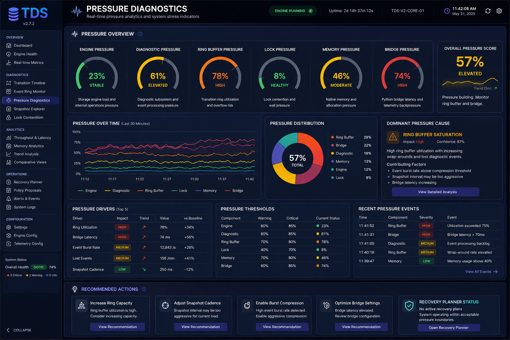

<p align="center">
    
</p>


# 🟦🟪🟧 Staqtapp-TDS v2.9.0

🇺🇸 **English** | 🇯🇵 [日本語](README_ja.md)

Staqtapp-TDS is a content-neutral Temporal Directory System: a directory-first virtual storage engine with radix routing, Swiss-table-style indexing, native diagnostics, browser operations telemetry, and optional Spiral-compatible trace workflows.

The core rule remains simple:

> TDS stores, retrieves, indexes, observes, and records provenance. It does not reason, reward, train, or mutate policy decisions on behalf of an AI system.

## What is new in v2.9.0
## v2.9.0 JSON performance codec

v2.9.0 upgrades the centralized JSON boundary into a performance-grade codec. TDS now probes optional `simdjson` and `orjson` once, keeps stdlib fallback safety, emits compact browser `status.json` payloads, and exposes codec stats for loads, dumps, backend usage, elapsed nanoseconds, and failovers.

Design note: `docs/41_v290_JSON_Performance_Codec.md`.


v2.9.0 completes the Spiral Rank observability loop. The Native Spiral Rank Engine still remains outside the storage hot path, while the admin layer now exposes cached browser feedback telemetry on a dedicated **Spiral Rank** analytics page. The dashboard shows run counts, native/fallback ratio, timings, score range, mean score, Top-N ranked traces, and recent run history.

## Highlights

- Directory-first VFS API with semantic routing zones and reserved namespace policy.
- Native Swiss-table-inspired `EntryIndex` backend where available.
- Native diagnostic event ring with loss-tolerant telemetry snapshots.
- Native Spiral Rank scoring loop with Python fallback and immutable per-run stats.
- Browser Operations Console Spiral Rank page with feedback telemetry, Top-N traces, and timing history.
- GIL-released native execution paths for indexing, checksum, chunk scanning, and rank scoring.
- Browser Operations Console with localized language packs and professional telemetry pages.
- RuntimeConfig generation control with stage, promote, and rollback semantics.
- Optional Spiral-compatible trace/provenance helpers.
- Local-only browser admin panel hardened with CSRF/origin protection and safe DOM rendering.

## Installation

```bash
python -m pip install -e .
```

Run the test suite:

```bash
pytest -q
```

Run the local browser console:

```bash
staqtapp-tds-admin panel
```

Health verification:

```bash
staqtapp-tds-admin verify --sample
```

Native sanitizer builds remain opt-in for development and CI:

```bash
STAQTAPP_TDS_SANITIZE=address python -m pip install -e .
STAQTAPP_TDS_SANITIZE=undefined python -m pip install -e .
```

## Native Spiral Rank Engine

```python
from staqtapp_tds.spiral import NativeSpiralRankEngine

engine = NativeSpiralRankEngine()
ranked = engine.rank(
    trace_ids=["trace_a", "trace_b", "trace_c"],
    scores=[0.91, 0.80, 0.91],
    confidences=[0.95, 0.90, 0.95],
    depths=[3, 1, 1],
    ages_ns=[0, 0, 0],
)

for result in ranked:
    print(result.rank, result.trace_id, result.score, result.native)
```

The score model is intentionally small and auditable:

```text
score = source_score * score_weight
      + confidence * confidence_weight
      - depth * depth_penalty
      - age_ns * age_penalty
```

Defaults live in `SpiralRankConfig`. Python performs validation and stable ordering; the native extension performs the numeric scoring loop when available.

For telemetry-grade visibility, use `rank_run(...)` instead of `rank(...)`:

```python
run = engine.rank_run(["a", "b", "c"], [0.2, 0.9, 0.5], limit=2)
print(run.stats.to_dict())
```

`SpiralRankStats` records `input_count`, `ranked_count`, `limited_count`, `dropped_by_limit`, native/fallback path, elapsed/scoring/sorting/shaping timings, min/max/mean score, warnings, and the active config id. These are observer statistics only; they do not feed back into storage, policy, or scoring control.

## Optional Spiral-compatible trace support

TDS can store Spiral-shaped workflow data without becoming the reasoning system:

```python
from staqtapp_tds import TDSFileSystem, create_spiral_run

fs = TDSFileSystem("root")
run = create_spiral_run(
    fs.root,
    "run_000041",
    problem={"prompt": "example task"},
    problem_id="p_812",
)

run.store_search_trace(
    "trace_0001",
    "candidate trace stored as ordinary TDS data",
    rank_score=0.87,
    rank_source="external_verifier_A",
)

run.create_trace_set("set_0001", ["trace_0001"])
run.store_final("answer.tds", "final answer", derived_from=["trace_0001"])
```

Typical layout:

```text
/spiral_runs/
  run_000041/
    problem.json
    search_traces/
    trace_sets/
    aggregations/
    final/
    metadata/
```

## Telemetry and dashboard boundary

Telemetry remains one-way and snapshot-driven. The dashboard reads cached telemetry; it does not crawl the storage engine on every refresh and does not put browser activity into the storage hot path.

Telemetry levels:

- `off`
- `minimal`
- `normal`
- `engineering`
- `developer`

## Design boundary

```text
Caller / verifier / ranker decides.
TDS stores trace data, metadata, scores, and provenance.
Native rank scoring accelerates copied numeric metadata only.
Dashboard observes immutable snapshots.
```

This keeps TDS useful under advanced AI workflows while preserving its storage identity.

## Release notes

v2.9.0 builds on the v2.8.7 Native Spiral Rank Engine. It adds immutable Spiral rank statistics, run-bundle export, stats tests, updated bilingual documentation, and preserves the list-returning v2.8.7 rank API.

Additional v2.9.0 design note: `docs/40_v290_Spiral_Rank_Browser_Telemetry.md`.
