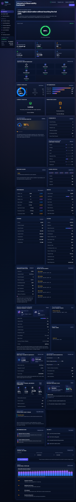

# 🟦🟪🟧 Staqtapp-TDS v3.1.25

[日本語版 / Japanese README](README_ja.md) · [API Surface Reference PDF](tds_api_docs/Staqtapp_TDS_v3_1_25_API_Surface_Reference.pdf)

<p align="center">
  
</p>

<p align="center"><em>Browser Operations Console — full telemetry-page overview captured at 1280×800.</em></p>

## v3.1.25 Browser & Studio Visual Consistency Hardening

Staqtapp(stacked-app) TDS v3.1.25 hardens the Browser dashboard and optional PyQt5 Driver Studio shell for visual consistency before the next persistence/edit-safety reliability layer.

The Browser stylesheet now keeps the sidebar control-plane card in normal flow, gives the long navigation list its own contained scroll region, restores compact-desktop grid breakpoints after later CSS overrides, reduces workload-card width pressure, contains architecture connector rails, and bounds hero-orbit placement so panels do not overlap or overhang at 1560×960, 1440×900, or 1280×800 screenshot sizes.

The Studio PyQt5 shell keeps its observe-only authority model while improving visual readiness: the main window now supports a 1280×800 minimum, safer dock nesting/tabbing, stronger panel minimums, clearer group-box and help-label styling, bounded scroll areas, readable text-edit padding, and better Manual Builder split sizing.


## v3.1.23 Driver Studio Stress Scenario Matrix

TDS v3.1.23 extends the v3.1.22 operational stress harness with a deterministic scenario matrix for named Browser, Studio, Manual Builder, `.tds` persistence, combined observation, and authority-denial stress paths.

The scenario matrix returns `StudioOperationalStressScenarioMatrix` evidence instead of halting host operation. It makes each stress path individually addressable while preserving the combined Browser + Studio + `.tds` proof path.

## v3.1.22 Driver Studio Operational Stress Harness

TDS v3.1.22 adds a headless operational stress harness for the completed Driver Studio runtime and Browser-style observer path. It exercises Browser snapshot polling, bounded Studio live-event overflow, Manual Builder JSON/signal payload safety, and `.tds` atomic persistence reader checks without widening Studio or Browser authority.

The harness returns `StudioOperationalStressReport` evidence instead of halting host operation. Event overflow is treated as acceptable pressure when it is explicitly counted, warned, and recoverable from the current immutable snapshot.

## v3.1.21 Driver Studio Runtime Hardening

TDS v3.1.21 strengthens the optional Driver Studio runtime after the v3.1.20 Export Integrity Workflow completion. It adds bounded live-event drop accounting, retained cursor floor reporting, retention-gap warnings for slow GUI polling, JSON-safe Manual Builder signal payload normalization, and focused runtime-hardening tests.

This is a confidence and safety release for the Studio cockpit runtime. Studio still only observes, hydrates, explains, verifies, and prepares intent. It does not approve, reject, quarantine, sign, activate, mutate Registry state, execute trusted drivers, write storage, store private keys, or bypass Runtime Manager / Foundry / Review Board / Registry policy.

## v3.1.20 Driver Studio Export Integrity Workflow

TDS v3.1.20 adds a Driver Studio Export Integrity Workflow above the v3.1.19 Export / Audit Console. It recomputes manifest and packet hashes, compares optional expected manifest/packet hashes, progresses export checklist checkpoints, and emits a review-safe readiness gate for external export tooling.

The workflow verifies and explains evidence readiness. It does not approve, reject, quarantine, sign, activate, mutate Registry state, execute trusted drivers, write storage, store private keys, or bypass Runtime Manager / Foundry / Review Board / Registry policy.

### v3.1.17 Driver VM Performance Evidence Harness

TDS v3.1.17 added an opt-in Driver VM Performance Evidence Harness. The harness gives TDS controlled insight into Python Driver VM search/extraction performance today and creates the parity target for a later optional native C Driver VM backend.

The design keeps normal Python driver performance clean:

```text
Normal DriverVMRuntime.execute()
  -> unchanged
  -> no benchmark loop
  -> no per-record timer hooks
  -> no automatic profiling

Explicit DriverVMPerformanceHarness.run_package(...)
  -> controlled repetitions
  -> direct Python VM timing
  -> optional Runtime Manager timing
  -> optional native C backend slot
  -> parity/performance evidence report
```

## Current validation status

```text
393 passed, 11 skipped
release check passed
```

## Current active development track

Driver Studio / Studio & Evidence subsystem, now focused on operational stress confidence, simultaneous Browser/Studio observation, named stress scenario evidence, bounded event-pressure visibility, and non-authoritative stress reporting.


## v3.1.23 adds

- `StudioOperationalStressScenario`
- `StudioOperationalStressScenarioResult`
- `StudioOperationalStressScenarioMatrix`
- `DEFAULT_OPERATIONAL_STRESS_SCENARIOS`
- `StudioOperationalStressHarness.run_scenario(...)`
- `StudioOperationalStressHarness.run_scenario_matrix(...)`
- named Browser polling stress scenario
- named Studio live-event overflow stress scenario
- named Manual Builder payload stress scenario
- named `.tds` persistence atomicity stress scenario
- combined Browser + Studio + `.tds` observation stress scenario
- explicit authority-boundary denial scenario
- JSON/signal-safe scenario matrix payloads
- updated API reference PDF under `tds_api_docs/`
- README / README_ja cross-links and API PDF links

## v3.1.22 adds

- `staqtapp_tds.studio_pyqt5.operational_stress`
- `StudioOperationalStressHarness`
- `StudioOperationalStressReport`
- `StudioOperationalStressObservation`
- `StudioOperationalStressStatus`
- `studio_operational_stress_capability_matrix()`
- Browser-style `AdminControl.status()` polling stress
- bounded Studio live-event overflow stress
- Manual Builder JSON/signal payload stress
- `.tds` atomic persistence reader/writer stress
- API reference PDF under `tds_api_docs/`
- README / README_ja cross-links and API PDF links
- authority-boundary preservation for all stress surfaces

## v3.1.21 adds

- bounded live-event stream drop accounting
- retained cursor floor reporting
- dropped event count reporting
- runtime retention-gap warnings
- JSON/signal-safe Manual Builder form payload normalization
- bridge/runtime/manual-builder factory cleanup
- focused Driver Studio runtime hardening tests
- authority-boundary preservation for all Studio runtime surfaces

## v3.1.20 adds

- `staqtapp_tds.studio_pyqt5.export_integrity_workflow`
- `StudioExportIntegrityWorkflow`
- `StudioExportIntegrityWorkflowState`
- `StudioExportIntegrityCheckpoint`
- `StudioExportIntegrityCheckpointStatus`
- `StudioExportIntegrityManifestComparison`
- `StudioExportIntegrityReviewGate`
- `StudioExportIntegrityWorkflowStatus`
- manifest hash recomputation
- packet hash recomputation
- expected manifest/hash comparison
- progressive export checkpoint rows
- review-safe export handoff gate
- deterministic export workflow hash
- bridge/runtime constructors for the workflow

## v3.1.17 adds

- `staqtapp_tds.drivers.performance`
- `DriverVMPerformanceHarness`
- `DriverVMPerformancePolicy`
- `DriverVMPerformanceReport`
- `DriverVMPerformanceRun`
- `DriverVMPerformanceSummary`
- `DriverVMPerformanceComparison`
- `DriverVMPerformanceStatus`
- `DriverVMPerformanceBackend`
- `driver_vm_performance_capability_matrix()`
- `driver_vm_performance_enabled()`
- direct Python VM benchmark evidence
- optional Runtime Manager overhead comparison
- optional native C backend parity slot
- deterministic result hash comparison
- records/sec, emitted/sec, and cost/sec metrics
- performance evidence hash
